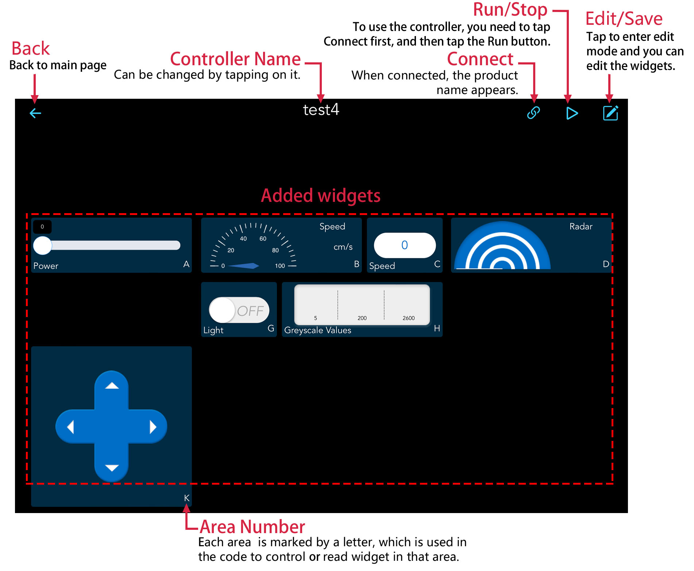

Controller Page
==================

Controller Name
--------------------------

#. Tap the |edit| button in the upper right corner of the controller page to enter edit mode.

#. Change the name of the controller at the location shown.

    .. image:: img/rename.png  

#. Tap the |save| button to save the changes.

Connect
-------------------

.. note::

    This |connect| button is available on both the home page and the controller page, and its function and usage are the same.

#. When you tap on the |connect| icon, if your product has run the code, the product name + IP will appear and you need to tap this to connect.

    .. image:: img/connect_icon.png

#. If the "Connected successfully" prompt appears, the product name will appear in the upper right corner.

    .. image:: img/connect_icon1.png

#. If it doesn’t search automatically, you can also manually enter the IP to connect.

        .. image:: img/sc-c-6.png

#. You can disconnect from this product by tapping on the product name and choosing **Confirm** in the pop-up window.

    .. image:: img/connect_icon3.png

Run/Stop
------------------

If you have successfully connected your product, tap the |run| button to turn on the controller, then you can use it to control your product.

.. image:: img/run_stop.png

Edit/Save
---------------------

.. note::
    This |edit| button is available on both the home page and the controller page, but the functions are not the same.

    * On the home page, after tapping it, you can delete the existing controller.
    * In the controller page, you can edit each widget after tapping it.

#. Tap the |edit| icon to enter the editing mode.

    .. image:: img/preset_pico2.PNG

#. At this point you can do the following with the controller, and when you're done tap the |save| button to save the changes.

    * :ref:`add_widget`
    * :ref:`delete_widget`
    * :ref:`edit_widget`

.. _add_widget:

Add/Replace Widgets
^^^^^^^^^^^^^^^^^^^^^^^^^
#. Tap the |edit| button in the upper right corner of the controller page to enter edit mode.
#. Tap the plus sign in any area or the widget already added, and select the widget you need in the pop-up widget list.

    .. note:: 
        * Each controller has A~Q, 17 areas, there are 3 different shapes of areas and different widgets for each shape, refer to: :ref:`widgets_list` for details.
        * Additional widgets can be selected by swiping left and right.

    .. image:: img/sc-a-5.jpg  

.. _delete_widget:

Delete Widgets
^^^^^^^^^^^^^^^
#. Tap the |edit| button in the upper right corner of the controller page to enter editing mode.
#. Tap the widget you need to delete, swipe left in the pop-up window to the end, and tap the **Delete** button.

    .. image:: img/delete_widget.png 

.. _edit_widget:

Edit Widgets
^^^^^^^^^^^^^^^
#. Tap the |edit| button in the upper right corner of the controller page to enter editing mode.
#. You will see the |set| icon in the top right corner of each widget, use this icon to set the name, value range, initial value and units for the widget.

    .. Note::

        Different widgets need different settings, please refer to: :ref:`widgets_list`.

    .. image:: img/edit_widget.png

