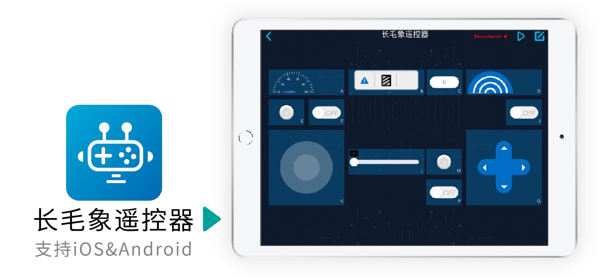

.. sunfounder-controller documentation master file, created by
   sphinx-quickstart on Mon Feb 14 14:57:29 2022.
   You can adapt this file completely to your liking, but it should at least
   contain the root `toctree` directive.

欢迎来到 长毛象遥控器APP 文档主页！
=================================================

| **长毛象遥控器** 是一款虚拟远程控制APP，用于控制百变积木控制板或者基于树莓派等开发板的其他机器人套件。 
| 该应用程序集成了按钮、开关、操纵杆、D-pad 滑块和油门滑块、数字显示、超声波雷达、灰度检测和车速表等部件。长毛象遥控器支持添加多个遥控器，每个配置最多可以添加17个区域(A-Q)，可以根据需要在其中放置不同的部件以自定义您自己的控制器。

.. toctree::
   :maxdepth: 2

   install
   quickstart
   page
   widget