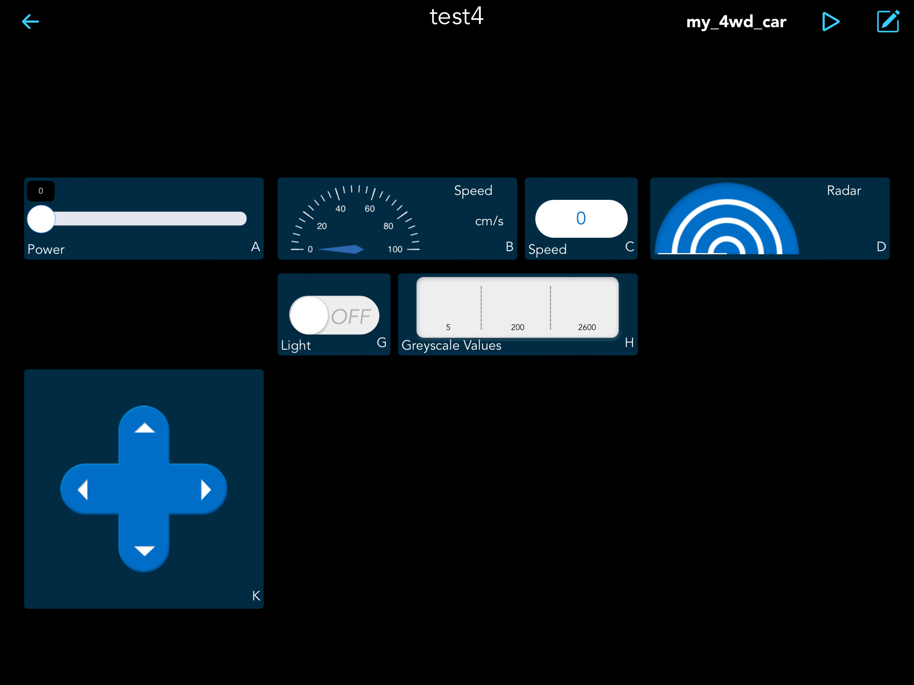

SunFounder Controller
==============================

SunFounder Controller is an application that allows users to customize the controller for controlling their robot or as an IoT platform.

It is suitable for Raspberry Pi, Raspberry Pi Pico/Pico W and Arduino. 

11 kinds of show and control widgets are integrated in this APP, such as Button, Joystick, Gauge, and Radar. 

The controller page has 17 areas from A~Q, you can place different widgets to customize your own controller.

In addition, this APP can also realize live video streaming, AI image recognition and voice recognition functions.

.. toctree::
    :maxdepth: 2

    install
    create_controller
    connect_ap_product
    page_introduction

