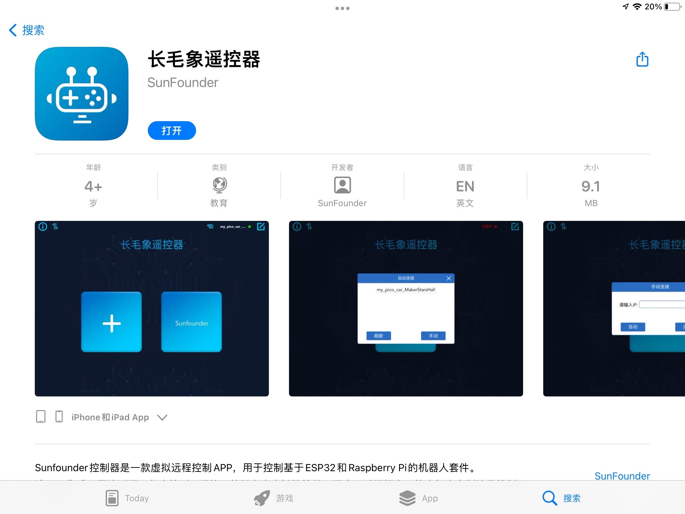

下载与安装
=================

长毛象遥控器是一款虚拟远程控制APP，用于控制基于Arduino树莓派以及各类开发板的机器人。目前支持Android与IOS操作系统。

Android 手机与平板
-------------------

安卓用户请点击 `此链接 <https://ezblock.com.cn/app_v2/mammoth_controller.apk>`_ 下载APP。下载后需要手动安装。

苹果 手机与平板
-------------------

使用苹果手机或者平板的同学们，可以前往 App Store 搜索 “长毛象遥控器” 安装，或者点击 `此链接 <https://apps.apple.com/cn/app/%E9%95%BF%E6%AF%9B%E8%B1%A1%E9%81%A5%E6%8E%A7%E5%99%A8/id1603754385>`_ 前往 App Store 下载。

