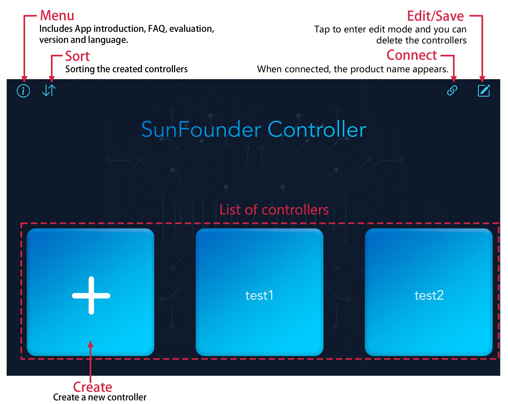

Home Page
==================

Menu
-------------

    .. image:: img/menu1.png  

* **About Us**: A description of SunFounder Controller and the company.
* **FAQ**: It will jump to this document when you tap it.
* **Evaluation**: It will jump to APP Store or Google Play, where you can evaluate it.
* **Version**: shows the current app version.
* **Language**: There are two display languages, Simplified Chinese and English, you can choose according to your needs.

Sort
---------------------

#. Tap the |sort| button in the upper left corner of the home page.

#. Drag the icon to adjust the order of the controllers in the pop-up window.

    .. image:: img/sort_controller.png  

Connect
-------------------
.. note::
    This |connect| button is available on both the home page and the controller page, and its function and usage are the same.

#. When you tap on the |connect| icon, if your product has run the code, the product name + IP will appear and you need to tap this to connect.

    .. image:: img/connect_icon.png

#. If the "Connected successfully" prompt appears, the product name will appear in the upper right corner.

    .. image:: img/connect_icon1.png

#. If it doesn’t search automatically, you can also manually enter the IP to connect.

    .. image:: img/sc-c-6.png

#. You can disconnect from this product by tapping on the product name and choosing **Confirm** in the pop-up window.

    .. image:: img/connect_icon3.png

Edit/Save
-----------------------

.. note::
    This |edit| button is available on both the home page and the controller page, but the functions are not the same.

    * On the home page, after tapping it, you can delete the existing controller.
    * In the controller page, you can edit each widget after tapping it.

#. Tap the |edit| icon to go to edit mode.

#. At this point, a |delete| icon will appear in the upper right corner of each controller.

    .. image:: img/delete-controller.png  

#. After deleting, tap the |save| button to exit to edit mode.

Create
--------------------

#. Tap the + button on the home page to create a controller.

    .. image:: img/add-controller-guide.png  

#. Select the template and set the name of the controller, then tap **Confirm** to add.

    .. image:: img/add-controller-guide2.png  

#. In the Preset section, we have some preset controllers for some products, you can choose according to your product. For example, tap Pico-4wd and give a name.

    .. image:: img/preset_pico.png

#. Upon entering, you will find some widgets have been added. If you don't need to modify anything, tap the |save| button to save this controller.

    .. image:: img/preset_pico2.PNG