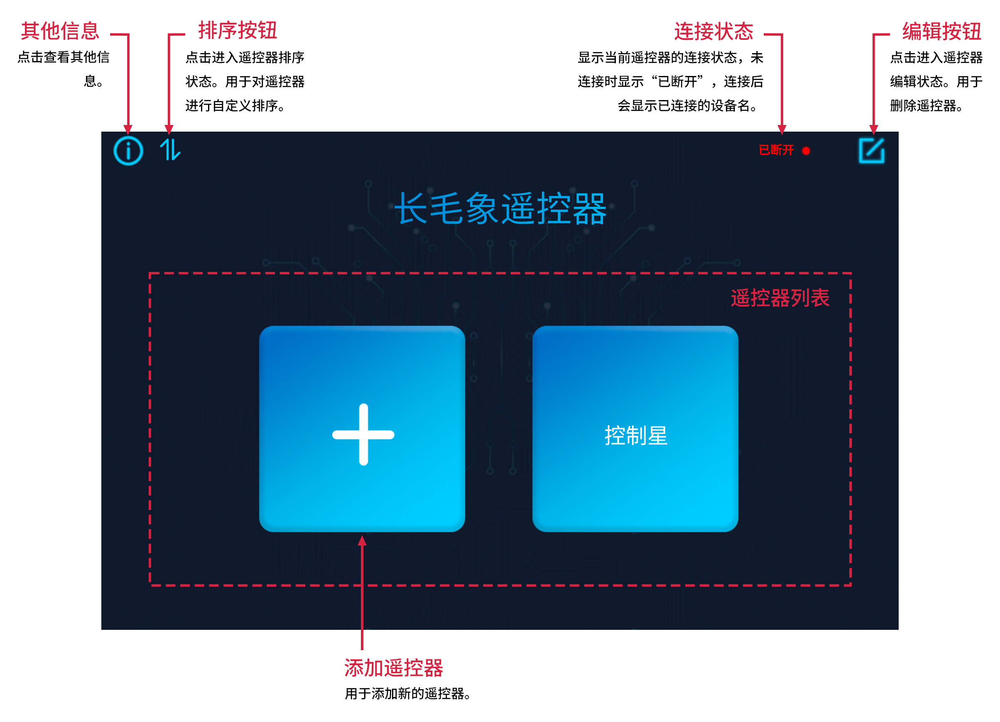

界面介绍
===================

.. contents:: 目录

主界面
-------------

添加遥控器
^^^^^^^^^^^^^^^
#. 在主界面点击添加遥控器的按钮。

    .. image:: img/add-controller-guide.png  
        :width: 400

#. 选择模板并设置遥控器的名字,然后点击确认添加遥控器。

    .. image:: img/add-controller-guide2.png  
        :width: 400

调整遥控器顺序
^^^^^^^^^^^^^^^
#. 点击主界面左上角的排序按钮 |sort| 。
#. 在弹出的窗口拖动遥控器的名字以调整遥控器的顺序。

    .. image:: img/sort.png  
        :width: 400

删除遥控器
^^^^^^^^^^^^^^^
#. 点击主界面右上角的编辑按钮 |edit1| ，点击后编辑按钮会变成红色 |edit2| 。
#. 点击遥控器列表中的遥控器右上角删除按钮 |delete| 。

    .. image:: img/delete-controller.png  
        :width: 400

#. 再次点击编辑按钮 |edit2| 退出编辑模式。

遥控器界面
-------------

.. image:: img/controller.png
    :width: 800

修改遥控器名称
^^^^^^^^^^^^^^^
#. 点击遥控器页面右上角的编辑按钮 |edit| 进入编辑状态。
#. 在图示位置修改遥控器的名称。

    .. image:: img/rename.png  
        :width: 400

#. 点击右上角的保存按钮 |save| ，保存变更。

添加部件
^^^^^^^^^^^^^^^
#. 点击遥控器页面右上角的编辑按钮 |edit| 进入编辑状态。
#. 点击任意区域的加号，选择添加的部件类型。

    .. image:: img/choose-widget.png  
        :width: 400

#. 点击部件右上角的齿轮 |setting| ，可以设置部件的属性。
#. 点击右上角的保存按钮 |save| ，保存变更。

更换部件
^^^^^^^^^^^^^^^
#. 点击遥控器页面右上角的编辑按钮 |edit| 进入编辑状态。
#. 点击要修改的部件，可以修改部件类型。

    .. image:: img/choose-widget.png  
        :width: 400

#. 点击部件右上角的齿轮 |setting| ，可以修改部件的属性。
#. 点击右上角的保存按钮 |save| ，保存变更。

删除部件
^^^^^^^^^^^^^^^
#. 点击遥控器页面右上角的编辑按钮 |edit| 进入编辑状态。
#. 点击删除的部件，向左滑动到最后，点击下图所示图标即可删除部件。

    .. image:: img/delete-widget.png  
        :width: 400

#. 点击右上角的保存按钮 |save| ，保存变更。

连接设备
^^^^^^^^^^^^^^^

.. note:: 
    在连接主设备前，需要确认 **安装了长毛象控制器APP的设备** 与 **将被遥控的设备** 连接的是 **同一个Wi-Fi** 。

#. 连接好Wi-Fi，打开要连接的设备。
#. 点击遥控器页面右上角的连接状态。

    .. image:: img/connect-guide.png  
        :width: 400

#. 等待一段时间，长毛象控制器APP会自动搜索同一网络下的设备。当出现对应的设备名，点击设备名连接对应设备。

    .. image:: img/connect-guide2.png  
        :width: 400

#. 连接成功后，连接状态的区域会显示已连接设备的名称。

    .. image:: img/connect-guide3.png  
        :width: 400

开启遥控器并遥控
^^^^^^^^^^^^^^^^^
#. 成功连接设备后，点击开启遥控器按钮 |play| ，开启遥控器。
#. 开启遥控器后，操控添加好的部件。

