快速使用
===============
本篇教程以长毛象遥控器APP遥控百变积木控制板上板载LED的亮灭作为示例，帮助你快速上手长毛象遥控器APP。

需要准备：
 #. 百变积木控制板。
 #. 安装了长毛象遥控器APP的设备。
 #. 2.4GHz 的 Wi-Fi 网络环境。 

添加遥控器
---------------

打开长毛象遥控器APP，我们可以看到界面中间有一个“+”，点击这个“+”，添加一个新的遥控器。

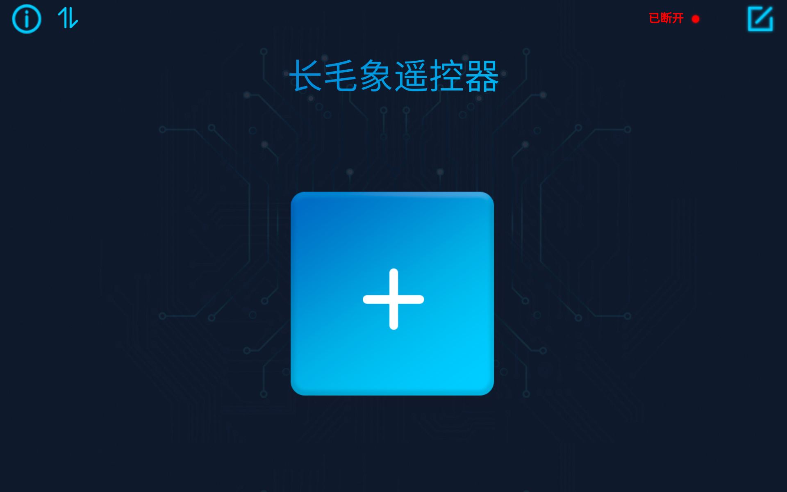

在弹出来的 “创建遥控器” 窗口中，选择空白模板，然后在名字文本框中输入 “控制星” 将这个遥控器命名为 “控制星” ，最后点击确定完成遥控器设置。

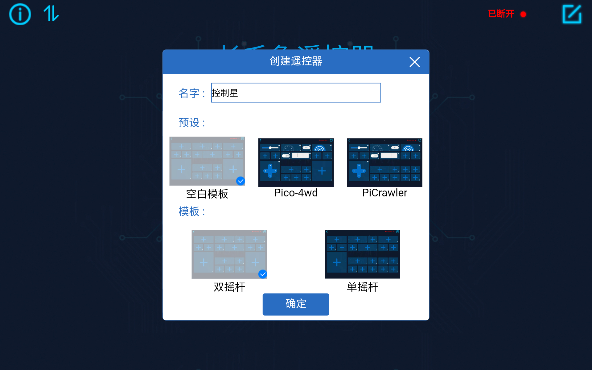

添加部件
---------------
完成遥控器设置后，我们进入遥控器里，这时我们会看到很多“+”，这些都是可以添加部件的区域。每个部件右下角的字母用于标识部件。

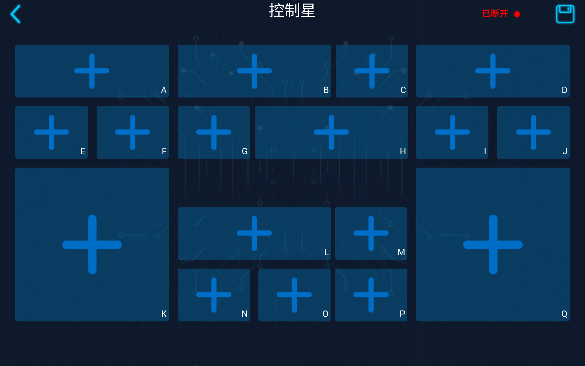

找到C区域，点击上面的“+”，在弹出的窗口中找到按钮部件，点击添加。

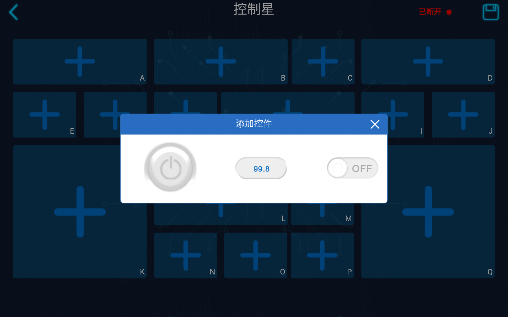

然后可以看到我们成功地在C区域添加一个按钮部件。点击C区域部件右上角齿轮可以设置这个部件的名字，我们设置为“LED”，表示这个按钮用于控制LED。

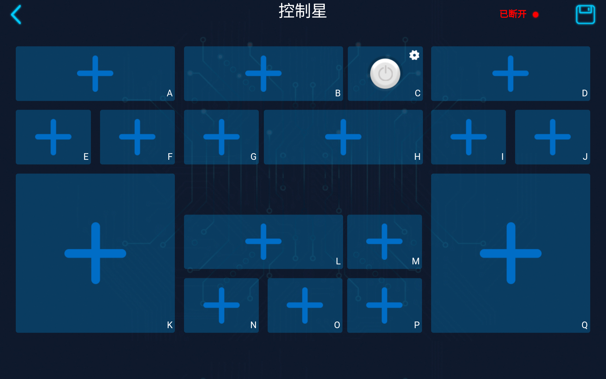

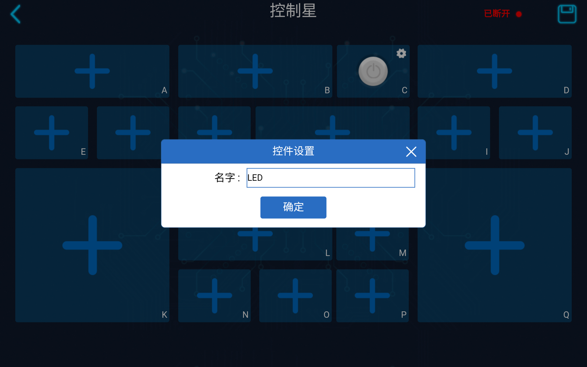

最终界面如下：

.. image:: img/add-widget5.png
    :width: 800

Mixly编程
---------------

打开 Mixly 编程软件，创建如下代码文件，然后编译上传到百变积木板上。

.. note:: 
    代码里的 Wi-Fi 名称与密码需要与安装了长毛象遥控器APP的设备连接的Wi-Fi保持一致 。而且 **必须是2.4GHz的Wi-Fi** 。

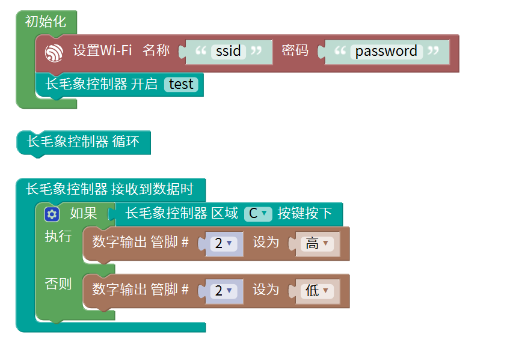

**代码讲解：**

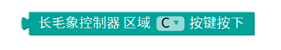

| 上图积木块的作用是读取指定区域按钮的状态。选择C区域，与之前我们在长毛象遥控器APP设置的遥控器对应。

连接与遥控
---------------

.. note:: 
    需要先确认 **安装了长毛象控制器APP的设备** 与 **百变积木控制板** 连接的是 **同一个Wi-Fi** 。

将代码上传到百变积木控制板后，打开百变积木控制板。
进入“控制星”遥控器，在右上角找到“已断开”，点击这三个字，点击后等待一段时间，“长毛象遥控器”APP会自动搜索同一网络下支持控制的设备，我们找到“test”设备，点击名字连接设备。

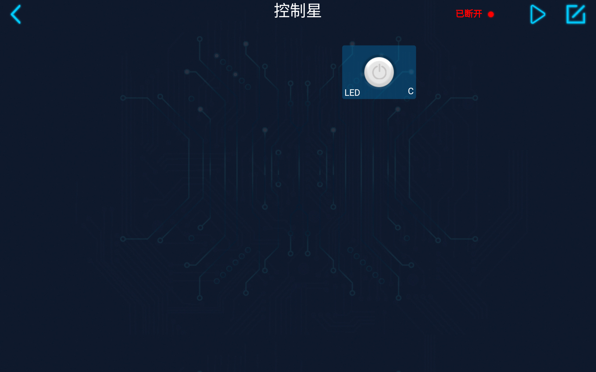

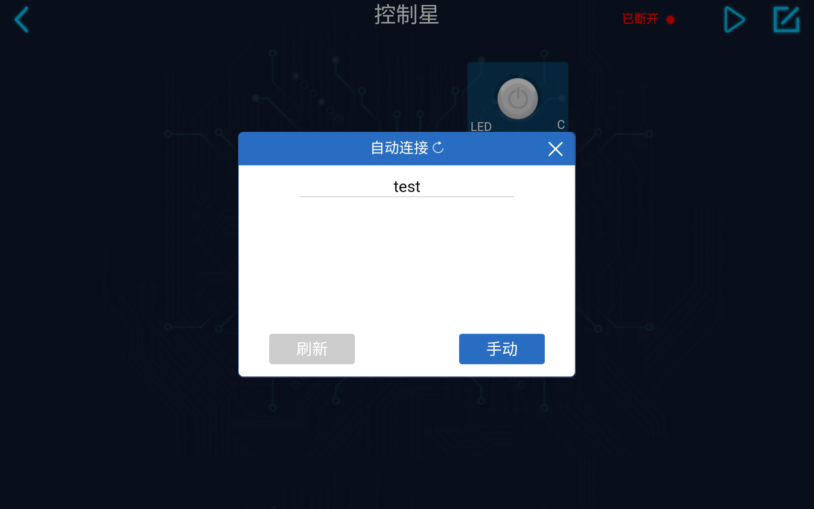

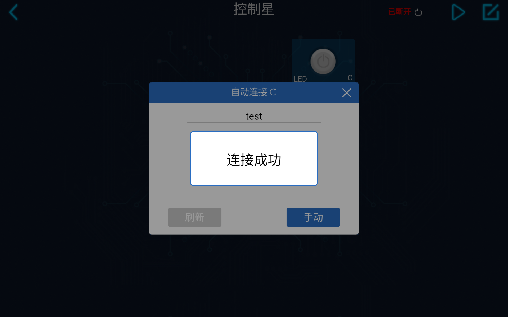

连接成功后，我们会发现“已断开”三个字已经变成了“test”。接着，点击右上角的“运行”按钮（三角形图案），开启遥控器。开启遥控器后，我们才能使用遥控器进行遥控。

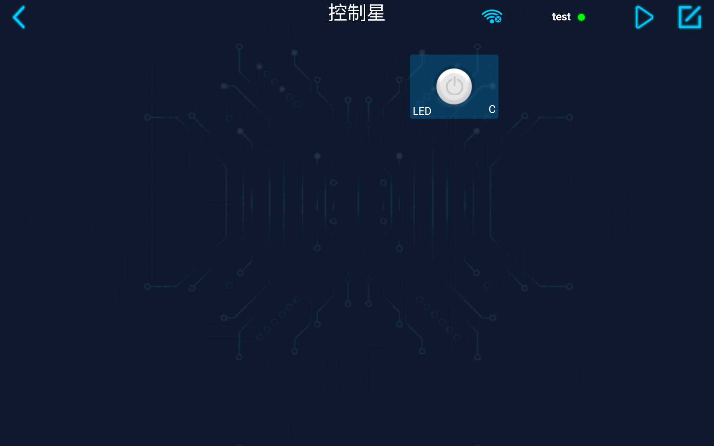

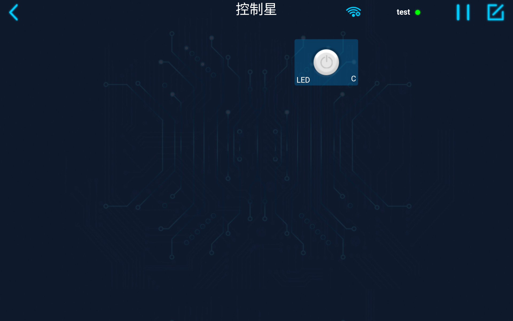

开启遥控器后点击遥控器里C区域的按钮。我们会发现，当手按着按钮时，LED会亮起，当松开按钮时LED又会熄灭。

